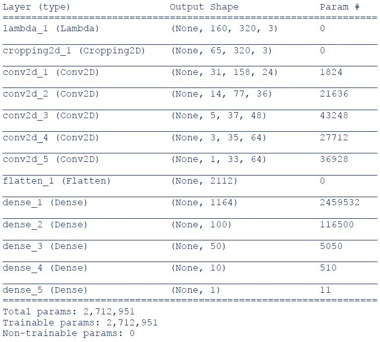

# UDACITY-CarND-Behavioral-Cloning

## Overview
This project is focusing on creating a deep learning neuro network and training it
by taking human behavior in track as input and generating steering angle as output.  

* In model.py, following concepts are included:
1. Preprocessing data from simulator
2. Augment data set
3. Build a NVIDIA convolution neural network in Keras that take images and steering .
   angles as training inputs than predicts steering angles as outputs.
4. Train and validate the model.
5. Test the model: Vehicle shall successfully drive on track in autonomous mode.

### Preprocessing Data from Simulator
In this project, in addition to records from my steering, default data stored in workspace also took a place in model training..


### Data Augmentation
* Mirroring Images
In track one, if driving counterclockwise, most of turns are left turn, this will lead to tendency of left turn bias, this issue can be addressed by either driver clockwise or mirroring input images and multiplying measurements by -1.

```
for image, measurement in zip(images, measurements): augmented_images.append(image) 
    augmented_measurements.append(measurement)
    augmented_images.append(np.fliplr(image))
    augmented_measurements.append(measurement * -1.0)
```


* Left and Right Cameras
To train the model to steer back to the center, images from left and right cameras act as if they were coming from the center camera, a constant – 0.2, was added to left views and vice versa.


```
for line in list_name:
        camera = np.random.choice(['center', 'left', 'right'])
        measurement = float(line[3])
        if camera == 'center':
            source_path = line[0]
        elif camera == 'left':
            source_path = line[1]
            measurement += 0.2
        else:
            source_path = line[2]
            measurement -= 0.2
```

### Model Architecture
Model architecture follows the one published by Nvidia in 2016. Figure below shows its architecture from original NVIDIA study. No Dropout or Maxpooling layer have been introduced to keep the model as NVIDIA’s study. On top of the model, input images was normalized and cropped to focusing on track rather than sky, threes…etc.
```
model = Sequential()
model.add(Lambda(lambda x: x/255.0 - 0.5 ,input_shape =  (160,320,3)))
model.add(Cropping2D(cropping=((70,25), (0,0))))
```


* Model summary


### Train and validate the model
Adam optimizer is used for training. At training procedure, EarlyStopping was introduced to stop training when model has stopped improving.

### Issues during training
* Overfitting
At beginning of training, validation error is much higher than training error. To deal this, first attempt is to mirror image to create more data. Second attempt is to modified model following instruction in lessons.

* Drive out of the track
At beginning, vehicle always goes out of track in sharp turns. The reason for this might be training dataset is focusing on keeping vehicle staying in the center of the road as much as possible. To address this, two attempts were used:
1. Intentionally steering vehicle to the side of the road and then steer back to the middle to train what to do if it gets off to the side of the road.
2. Using cameras from left and right and adjust measurements.
Replacing dataset of driving in the center of the road by Udacity default dataset in workspace. Low FPS in manual mode caused control vehicle very difficult in manual mode. To enhance input data quality, default data was used for training.
